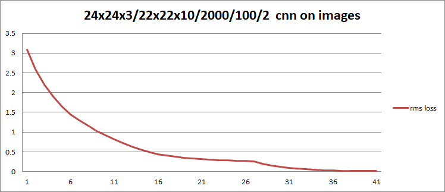

# neural-cs
Convolutional Neural Network in Pure C#

```
var nn = new NeuralNetwork(new SquaredErrorLoss(), 0.01);
nn.Add(new FullyConnectedLayer(2, 5, new LeakyReLuActivation()));
nn.Add(new FullyConnectedLayer(5, 5, new LeakyReLuActivation()));
nn.Add(new FullyConnectedLayer(5, 1, new LeakyReLuActivation()));
```


```
var nn = new NeuralNetwork(new SquaredErrorLoss(), 0.0001);
nn.Add(new ConvolutionLayer(24, 24, 3, 3, 10, new LeakyReLuActivation()));
nn.Add(new ConvolutionLayer(22, 22, 10, 3, 5, new LeakyReLuActivation()));
nn.Add(new FlattenLayer(20, 20, 5));
nn.Add(new FullyConnectedLayer(20 * 20 * 5, 100, new LeakyReLuActivation()));
nn.Add(new FullyConnectedLayer(100, 2, new LeakyReLuActivation()));
```

